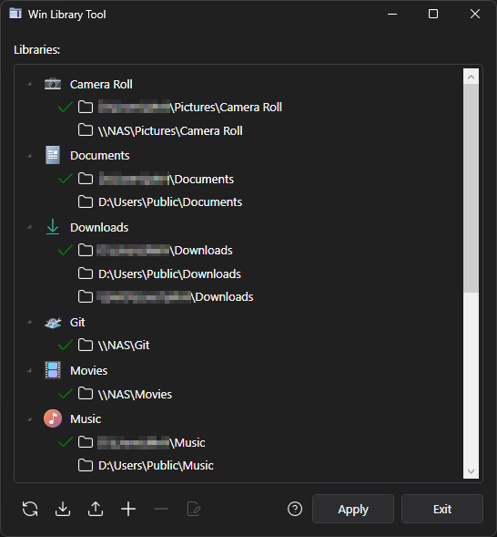
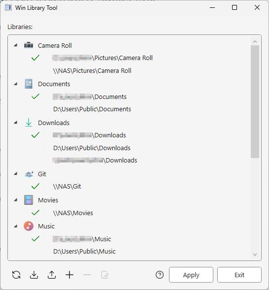
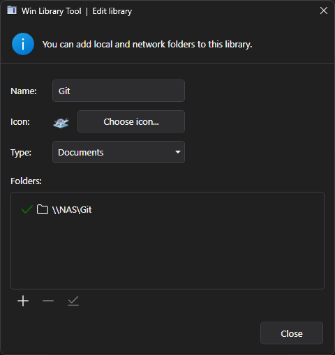
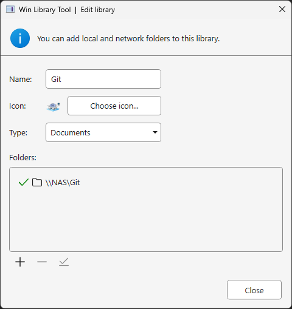

### Win Library Tool

This tool provides the following features not available in Windows:

* Add network (UNC or mapped drive) and any other un-indexed folders to libraries.
* Backup library configuration, such that a saved set of libraries can be instantly restored at any point.
* Create a mirror of all libraries (using symbolic links) in [SystemDrive]:\libraries.
* Change a library's icon.

For more info see:

[http://zornsoftware.codenature.info/blog/win7-library-tool.html](https://web.archive.org/web/20190826003547/http://zornsoftware.codenature.info/blog/win7-library-tool.html)

### What's New in v1.1.0 (2025)

This fork introduces several enhancements and modernizations:

- ✨ **Revamped UI**: Redesigned interface inspired by the Fluent Design System for a more modern and cohesive experience.
- 🌗 **Theme Adaptation**: Built-in support for both dark and light themes based on system settings.
- 🛠️ **Visual Studio 2022 Support**: The project can now be compiled using Visual Studio 2022.
- 🔧 **.NET Framework Update**: Retargeted to .NET Framework 4.7.2 for improved compatibility and performance.
- 📂 **Automatic Library Loading**: Existing Windows libraries are now detected and loaded automatically at startup.
- 🧹 **Code Improvements**: Minor refactoring and bug fixes (with the usual possibility of new bugs).
- 🧪 **Compatibility Notes**: Fully tested on Windows 11 24H2. Windows 7 remains supported, but the legacy Glass Panel effect has been removed due to incompatibility with newer UI styles.

### UI Snapshots

Below are examples of the revamped interface in both dark and light themes, showcasing the updated design and improved usability.

#### 🌙 Main Window – Dark Theme

#### ☀️ Main Window – Light Theme

#### 🌙 Edit Library – Dark Theme

#### ☀️ Edit Window – Light Theme

> The new UI adapts seamlessly to system theme settings, offering a consistent experience whether you're working in daylight or after hours.
